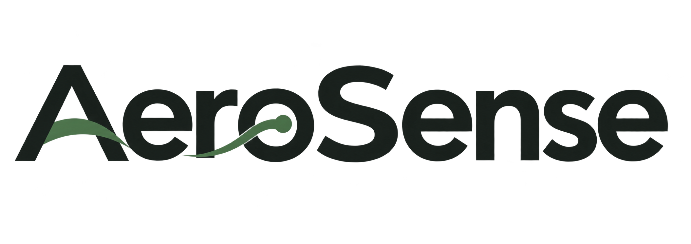

<p align="center">
  <picture>
    <source media="(prefers-color-scheme: dark)" srcset="assets/images/AeroSense_深色Logo_exec88eccbbe_ver8.7.9.png">
    
  </picture>
</p>
<p align="center">
  <picture>
    <source media="(prefers-color-scheme: dark)" srcset="assets/branding/Autonomy_motion_v6_vector_dark.svg">
    
  </picture>
</p>
<p align="center"><strong>Digital Twin · Precision Cultivation · Autonomous Operations</strong></p>
<p align="center">云雾工厂项目团队</p>

# AeroSense

**源码与资产公开供查看。使用、转载或分发须取得云雾工厂项目团队书面授权。**

AeroSense连接雾培生产的关键环节：从健康种源、环境感知与精准调控，
到品质校验、采收分选与批次交付。数字孪生呈现设备结构和生产过程，
AeroSense Autonomy组织分析与运维任务，设备控制服务负责采集、指令下发和反馈核验。

本仓库收录系统源码、三维模型和配套视觉资产，涵盖生产流程、系统架构、
交互逻辑与视觉呈现。系统源码版本为 **v5.18**，独立设备控制模块为 **Control v1.0**。

## 工程验证

[](https://github.com/LateBlightProj/AeroSense/actions/workflows/control-verification.yml)

GitHub Actions执行设备协议与控制逻辑测试，每次运行关联源码提交，保留逐项结果与运行日志。
测试覆盖Modbus TCP通信、参数写入与读回、联锁、断连与超时、指令去重、记录与恢复。
测试环境与范围见[Control模块说明](control/README.md)，运行记录见[工程验证](https://github.com/LateBlightProj/AeroSense/actions/workflows/control-verification.yml)。

## 权利与授权

**保留所有权利。**

授权范围涵盖团队自有的源码、界面设计、AeroSense与Autonomy标识、团队Logo、
图像、材质贴图、三维模型、动画、音效和文档。无论整体使用还是单独提取，
商业或非商业的运行、部署、修改、二次开发、复制、转载和分发，均须事先取得团队书面授权。

完整条款见[LICENSE](LICENSE)。GitHub平台许可及适用法律允许的行为依各自规定，
第三方组件遵循其原有许可证。

授权申请请通过本仓库Issue联系团队，说明申请主体、使用目的、内容范围、方式与期限。
团队将根据具体需求明确授权范围。

## 系统构成

| 模块 | 作用 |
|---|---|
| 生产数字孪生 | 设备结构、作物阶段、回路流动、运行状态和多机位观察 |
| AeroSense Autonomy | 本地分析任务、过程反馈和运维状态呈现 |
| 根系与静电工作台 | 图层与批次记录核对、参考值计算、调控参数确认 |
| 品质与批次链路 | 源头质控、光谱采集、分流、采后处理与交付记录 |
| 流程控制 | 统一时钟、任务调度与交互控制 |
| 设备通信与控制 | Modbus TCP测点采集、参数写入、联锁核对、设备应答与读回验证 |
| 生产监控与记录 | SSE采集流、历史趋势、连接状态、指令回执与SQLite审计 |

## 源码导航

| 路径 | 内容 |
|---|---|
| `src/` | 流程、界面、工作台、时钟、音效与打包代码 |
| `src/three-src/` | 三维场景、设备、材质、相机及动画源码 |
| `src/three-src/models/` | 三维资产及完整性清单 |
| `control/` | 设备控制服务、协议适配器、监控台、配置与测试 |
| `templates/` | 基础页面与控制器构建模板 |
| `assets/images/` | 页面图像与公开版岗位占位图 |
| `third-party/` | 第三方许可正文 |
| `source-provenance.json` | 发布来源、资源哈希与整理记录 |

## 已获授权人员的构建方式

需Node.js 20或更高版本。

```sh
npm ci
npm run check
npm run build
```

构建产物位于`dist/`。

设备控制服务使用Python 3.10或更高版本。配置方式、测点映射、接口和指令状态见[Control模块说明](control/README.md)。

```sh
python -m unittest discover -s control/tests -v
python -m control.server --config control/config.local.json
```

## 署名

云雾工厂项目团队 · AeroSense / AeroSense Autonomy

**Source and assets available for viewing. All rights reserved.**
Prior written permission is required to use, modify, republish or redistribute the team's
code, logos, images, textures, 3D models, animations and other assets, subject to applicable law
and GitHub's Terms of Service. See [LICENSE](LICENSE).
